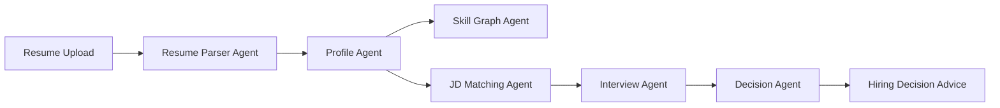

<div align="center">

# TalentFlow

> AI 招聘决策智能体平台：让招聘从经验判断走向证据驱动。

[](https://nextjs.org/)
[](https://react.dev/)
[](https://www.typescriptlang.org/)
[](https://tailwindcss.com/)

不是筛简历，而是重构招聘决策流。

</div>

---

## 在线体验

- Demo 地址：`/demo`
- 一键体验：无需 API Key，内置候选人、岗位 JD、匹配证据链、风险追问和候选人排序
- 演示视频：待补充
- 参赛赛道：小鹏 AI 公开赛

## 核心亮点

1. 多智能体招聘决策流：解析、画像、图谱、匹配、面试、决策多个 Agent 协同。
2. 可解释人岗匹配证据链：JD 要求、简历证据、匹配判断、风险动作可追溯。
3. 候选人能力图谱与岗位差距诊断：区分已有技能、岗位要求和缺失技能。
4. 基于风险点的 AI 面试追问：由 yellow/red 风险自动生成结构化追问。
5. 批量候选人排序：一个岗位下横向比较多个候选人，输出 Top 推荐。

## Agent 工作流



## 赛题适配说明

TalentFlow 面向招聘决策场景，通过多 Agent 协同完成候选人识别、能力理解、人岗匹配、风险追问与录用建议生成，解决传统招聘中效率低、判断主观、过程不可追溯的问题。

项目不是简单给 HR 一个分数，而是把每个判断拆解为证据链和后续动作：岗位要求是否命中、简历中有什么证据、哪些风险需要面试验证、下一步是否进入技术面。

---

## 核心功能

### 一键体验

- `/demo` 页面内置稳定演示数据
- 无需上传简历、无需配置 API Key
- 展示候选人池、Java 后端 JD、Agent 执行状态、证据链匹配、风险追问和候选人排序

### AI 简历解析

- 支持 PDF、Word、图片等多格式简历上传
- AI 自动提取结构化候选人信息
- 智能字体编码检测，自动降级到视觉 OCR 路径

### 候选人管理

- 可视化候选人卡片列表，支持搜索和筛选
- 候选人详情页含概览、技能图谱、面试记录和匹配结果
- 侧边抽屉展示原始简历文件，便于核实 AI 解析结果

### 可解释智能匹配

- 多维度加权匹配：技能、经验、岗位适配、成长潜力
- 输出 JD 要求到简历证据的可追溯链路
- 风险分层：强匹配、待追问、高风险
- 匹配风险可一键转为技术面试问题

### 人岗差距技能图谱

- 抽取 JD 技能要求并与候选人技能对比
- 区分候选人已有、岗位要求、双方命中和缺失技能
- 缺失的硬性要求会明显标红

### 批量候选人排序

- 一个岗位 JD 横向比较多个候选人
- 输出排名、分数、等级、优势、风险和建议动作
- 未配置 API Key 时自动使用 Demo 排序结果兜底

### 结构化面试助手

- 生成问题时说明为什么问、验证什么风险、对应简历证据
- 回答评估包含准确性、逻辑、深度、真实性和表达五个维度
- 面试报告给出下一步建议、下一轮重点和保留风险

---

## 技术栈

| 层级 | 技术选型 |
|------|---------|
| 框架 | Next.js 16 App Router + React 19 |
| 语言 | TypeScript 5 |
| 样式 | Tailwind CSS 4 + Liquid Glass 设计系统 |
| 状态管理 | Zustand |
| AI 集成 | Vercel AI SDK，支持 OpenAI / Anthropic / Google 等模型 |
| 图表 | Recharts |
| 文件解析 | pdf-parse + mammoth |
| 本地存储 | IndexedDB + localStorage |
| 图标 | Lucide React |

---

## 快速开始

### 环境要求

- Node.js >= 18
- npm / yarn / pnpm

### 安装

```bash
git clone https://github.com/your-username/talentflow.git
cd talentflow
npm install
npm run dev
```

打开 [http://localhost:3000](http://localhost:3000) 访问应用。

### 模型配置

首次使用真实 AI 能力时，在 `/settings` 配置模型名称、API Key 和 Base URL。`/demo` 与 `/ranking` 的 Demo 兜底不依赖模型配置。

---

## 项目结构

```text
talentflow/
├── src/
│   ├── app/
│   │   ├── api/
│   │   │   ├── batch-match/
│   │   │   ├── extract-jd-skills/
│   │   │   ├── interview/
│   │   │   ├── match/
│   │   │   └── parse-resume/
│   │   ├── demo/
│   │   ├── ranking/
│   │   ├── candidates/
│   │   ├── interview/
│   │   ├── match/
│   │   └── upload/
│   ├── components/
│   │   ├── demo/
│   │   ├── home/
│   │   ├── match/
│   │   ├── ranking/
│   │   ├── skills/
│   │   └── ui/
│   ├── lib/
│   │   ├── ai/
│   │   ├── demo/
│   │   ├── skills/
│   │   ├── store/
│   │   └── db.ts
│   └── types/
└── README.md
```

---

## 部署

### Vercel

```bash
npm i -g vercel
vercel
```

### Docker

```bash
docker build -t talentflow .
docker run -p 3000:3000 talentflow
```

---

## 许可证

本项目采用 MIT License。

